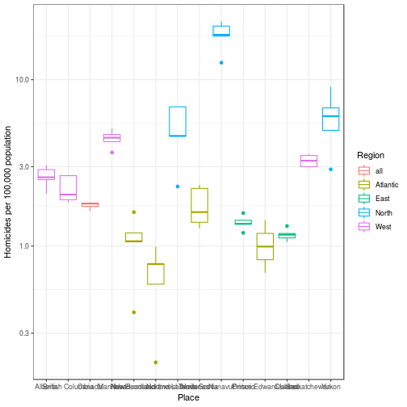
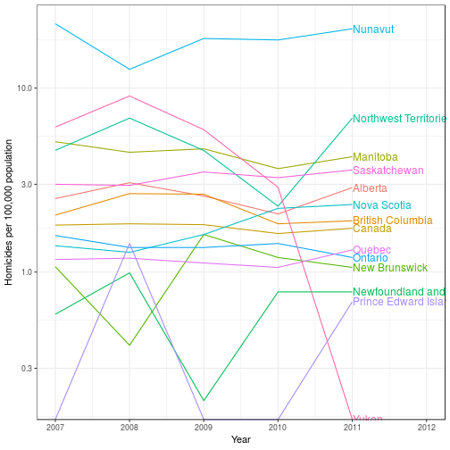

Load data from previous computations:

```r
load("data/CA_homicide.RData")
```

One of the advantages of long format is that it allows us to use some of R's more powerful graphics tools such as the `ggplot2` and `lattice` packages (and it's what most statistics packages expect):


```r
library(ggplot2)
theme_set(theme_bw())  ## black-and-white theme
p1 <- ggplot(mdat,aes(Year,Hom_rate,colour=Place))
```


```r
print(p1+geom_line())
```


We could add both lines and points:

```r
print(p1+geom_line() +geom_point())
```


Might be better on a log scale, with a sensible y-axis label:

```r
p1L <- p1 + geom_line()+
  scale_y_log10()+labs(y="Homicides per 100,000 population")
print(p1L)
```

```
## Warning: Transformation introduced infinite values in continuous y-axis
```


Maybe we don't care about time at all:

```r
b1 <- ggplot(mdat,aes(x=Place,y=Hom_rate,
                      colour=Region))+
  geom_boxplot(outlier.colour=NULL)+  ## set outlier points to same colour
  scale_y_log10()+labs(y="Homicides per 100,000 population")
print(b1)
```

```
## Warning: Transformation introduced infinite values in continuous y-axis
```

```
## Warning: Removed 4 rows containing non-finite values (stat_boxplot).
```



The labels are horrible. This is less familiar, but not a bad solution ...

```r
print(b1+coord_flip()+xlab("")+scale_colour_brewer(palette="Dark2"))
```

```
## Warning: Transformation introduced infinite values in continuous y-axis
```

```
## Warning: Removed 4 rows containing non-finite values (stat_boxplot).
```


Maybe we want to make our line graph less busy:

```r
print(p1L+facet_wrap(~Region))
```

```
## Warning: Transformation introduced infinite values in continuous y-axis
```


We could also code population size by line width:

```r
p2 <- ggplot(mdat,
             aes(Year,Hom_rate,colour=Region,size=log(Pop_2011),
                 group=Place))+geom_line(alpha=0.5)+
  scale_y_log10()+labs(y="Homicides per 100,000 population")
print(p2)
```

```
## Warning: Transformation introduced infinite values in continuous y-axis
```


## Experimental


Using the [directlabels](http://directlabels.r-forge.r-project.org/) package (also on [GitHub](https://github.com/tdhock/directlabels)):


```r
library(directlabels)
direct.label(p1L)+
  expand_limits(x=2004,y=0.1)
```

```
## Warning: Transformation introduced infinite values in continuous y-axis

## Warning: Transformation introduced infinite values in continuous y-axis

## Warning: Transformation introduced infinite values in continuous y-axis
```



Still needs work ... 

