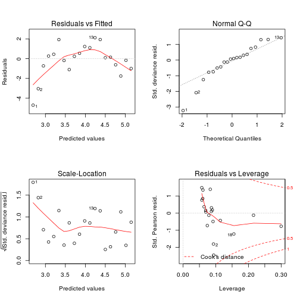
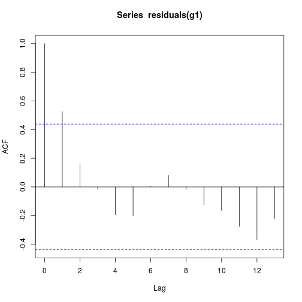

### Basics
* definition: '''family''' + '''link function'''

* family: what kind of data do I have? (from '''first principles''') (in particular, specifies the relationship between the mean and variance)
	* binomial: proportions, out of a total number of counts; includes binary (Bernoulli) (''logistic regression'')
	* Poisson (independent counts, no set maximum, or far from the maximum)
	* other (Normal, Gamma)

* link function: on what scale are the data linear?
	* there is typically a "canonical" answer (sensible + nice math)
	* Poisson=log; binomial=logit
		* ''inverse-link'': exponential; logistic (respectively)
	* further discussion of logit scale (picture below)
	* rules of thumb

* GLMs construct a "linear predictor" $x$ that (roughly) fits the data on the link scale
	* The fit does not apply the link function to the responses, but instead applies the ''inverse'' link function to the linear predictor
	* e.g., instead of $\log(y) \sim x$, we analyze $y \sim \mathrm{Poisson}(\exp(x))$
	* This is good, because the observed value of $y$ might be zero


* model setup: same as linear models (categorical, continuous) but now we are fitting on the linear predictor (link) scale


### diagnostics

* a little harder than linear models: `plot` is still somewhat useful

* binary data especially hard

* goodness of fit tests, $R^2$ etc. hard (can always compute `cor(observed,predict(model, type=response))`)

* residuals are ''Pearson residuals'' by default (scaled by expected variance); predicted values are on the link scale (e.g. log/logit) by default

* OVERDISPERSION
	* too much variance: (residual deviance)/(residual df) should be $\approx 1$.  (If the ratio is >1.2, worry a little bit; if the ratio is greater than $\approx 3$, something else might be wrong with your model.)
	* quasi-likelihood models
	* negative binomial etc.
	* NB=Poisson; binomial=beta-binomial

### inference

* Wald $Z$ tests (i.e., results of `summary()`), confidence intervals
	* Approximate, can be way off if parameters have extreme values
	* Asymptotic (finite-size correction is hard)

* likelihood ratio tests (equivalent to  $F$ tests); `drop1(model,test="Chisq")`, `anova(model1,model2)`), profile confidence intervals (`MASS::confint.glm`)

* AIC

### Model procedures

* formula similar to `lm` (but specifies relationship on linear predictor scale)

* specify family and link

* always do Poisson, binomial regression on ''counts'', never proportions (although you can specify response as a proportion if you also give $N$ as the `weights` argument

* Use offsets to address unequal sampling

* always check for overdispersion ''unless'' (1) already using quasilikelihood or (2) using binary data

* if you want to quote values on the original scale, confidence intervals need to be back-transformed; never back-transform standard errors alone

### Other things worth mentioning

* ordinal data
* complete separation
* non-standard link functions
* visualization (hard because of overlaps: `stat_sum`, `position="jitter"`, `geom_dotplot`
([http://stackoverflow.com/questions/11889353/avoiding-overlap-when-jittering-points beeswarm plot]))


```
## Error: Unknown parameters: family
```


```
## 
## Call:
## glm(formula = cases ~ date, family = quasipoisson(link = "log"), 
##     data = aids)
## 
## Deviance Residuals: 
##     Min       1Q   Median       3Q      Max  
## -4.7046  -0.7978   0.1218   0.6849   2.1217  
## 
## Coefficients:
##               Estimate Std. Error t value Pr(>|t|)    
## (Intercept) -1.023e+03  6.806e+01  -15.03 1.25e-11 ***
## date         5.168e-01  3.425e-02   15.09 1.16e-11 ***
## ---
## Signif. codes:  0 '***' 0.001 '**' 0.01 '*' 0.05 '.' 0.1 ' ' 1
## 
## (Dispersion parameter for quasipoisson family taken to be 2.354647)
## 
##     Null deviance: 677.26  on 19  degrees of freedom
## Residual deviance:  53.02  on 18  degrees of freedom
## AIC: NA
## 
## Number of Fisher Scoring iterations: 4
```




```
## 
## Call:
## glm(formula = cases ~ poly(date, 2), family = quasipoisson(link = "log"), 
##     data = aids)
## 
## Deviance Residuals: 
##     Min       1Q   Median       3Q      Max  
## -3.3290  -0.9071  -0.0761   0.8985   2.3209  
## 
## Coefficients:
##                Estimate Std. Error t value Pr(>|t|)    
## (Intercept)     3.86859    0.05004  77.311  < 2e-16 ***
## poly(date, 2)1  3.82934    0.25162  15.219 2.46e-11 ***
## poly(date, 2)2 -0.68335    0.19716  -3.466  0.00295 ** 
## ---
## Signif. codes:  0 '***' 0.001 '**' 0.01 '*' 0.05 '.' 0.1 ' ' 1
## 
## (Dispersion parameter for quasipoisson family taken to be 1.657309)
## 
##     Null deviance: 677.264  on 19  degrees of freedom
## Residual deviance:  31.992  on 17  degrees of freedom
## AIC: NA
## 
## Number of Fisher Scoring iterations: 4
```

```
## Analysis of Deviance Table
## 
## Model 1: cases ~ date
## Model 2: cases ~ poly(date, 2)
##   Resid. Df Resid. Dev Df Deviance      F   Pr(>F)   
## 1        18     53.020                               
## 2        17     31.992  1   21.028 12.688 0.002399 **
## ---
## Signif. codes:  0 '***' 0.001 '**' 0.01 '*' 0.05 '.' 0.1 ' ' 1
```


