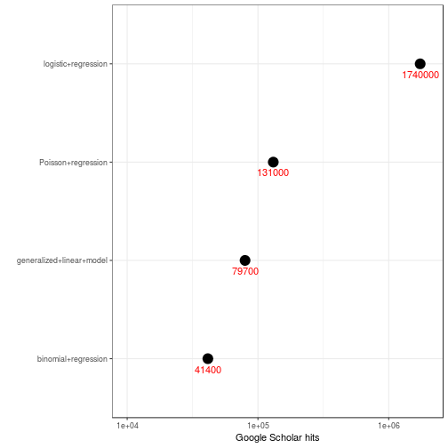
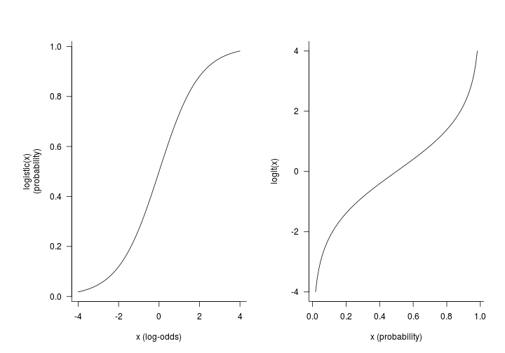
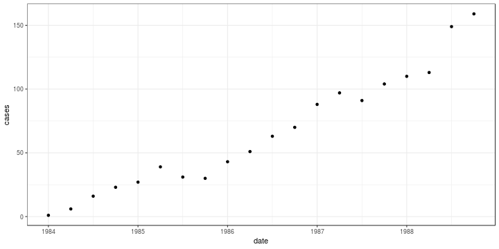
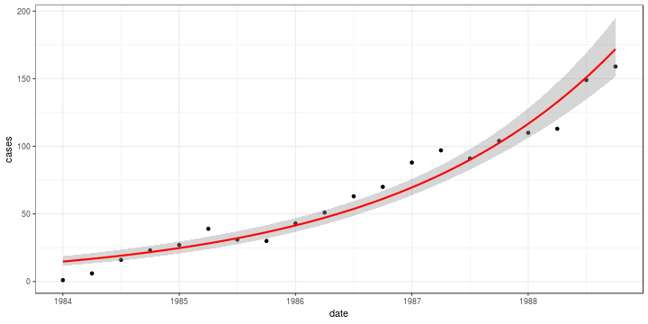
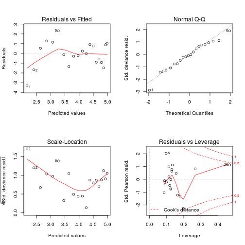
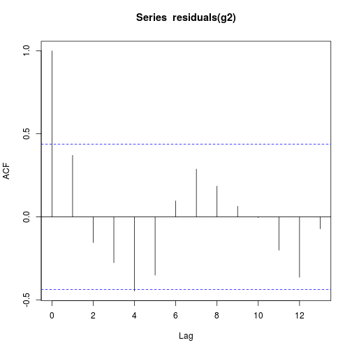

# Basics

## Basics

- in R: `glm()`, model specification as before:
`glm(y~f1+x1+f2+x2, data=..., ...)`
- definition: *family* + *link function*

## Family

- family: what kind of data do I have?
    - from **first principles**: family specifies the relationship between the mean and variance
	- binomial: proportions, out of a total number of counts; includes binary (Bernoulli) ("logistic regression")
	- Poisson (independent counts, no set maximum, or far from the maximum)
	- other (Normal (`"gaussian"`), Gamma)
- default family for `glm` is Gaussian

## Most GLMs are logistic




## Link functions

- on what scale are the data linear?
- link function goes from 'data scale' (bounded) to 'effect scale' (unbounded)
    - Poisson=log; binomial=logit
- *inverse link* function goes from effect scale to data scale
    - Poisson=exponential; binomial=logistic
- each family has a "canonical" link (sensible + nice math)
    - usually OK to use canonical link (except: Gamma/log)
    - probit vs. logit link for binomial family; mostly cultural

## Machinery

- "linear predictor" $\eta = \beta_0 + \beta_1 x_1 + \ldots$ that (roughly) fits the data on the link scale
- Fit doesn't apply link function to the responses: instead applies *inverse* link function to the linear predictor 
    - e.g., instead of $\log(y) \sim x$, we analyze $y \sim \mathrm{Poisson}(\exp(x))$
- This is good, because the observed value of $y$ might be zero
    - e.g. count (Poisson) phenotype vs. temperature (centered at 20 C)
	- with $\beta=\{1,1\}$, $T=15$, $\textrm{counts} \sim \textrm{Poisson}(\lambda=-4=0.018)$
- model setup: as linear models (categorical/continuous) but fit on the linear predictor (effect, link) scale

## logit/logistic function



## diagnostics

- a little harder than linear models: `plot` is still somewhat useful
- binary data especially hard (e.g. `arm::binnedplot`)
- goodness of fit tests, $R^2$ etc. hard (can always compute `cor(observed,predict(model, type=response))`)
- residuals are *Pearson residuals* by default ($(\textrm{obs}-\textrm{exp})/V(\textrm{exp})$); predicted values are on the effect scale (e.g. log/logit) by default (use `type="response"` to get data-scale predictions)


## overdispersion

- too much variance: (residual deviance)/(residual df) should be $\approx 1$.  (If the ratio is >1.2, worry a little bit; if the ratio is greater than $\approx 3$, something else might be wrong with your model.)
- quasi-likelihood models (e.g. `family=quasipoisson`); fit, then adjust CIs/p-values
- negative binomial etc.
- alternatives:
    - Poisson $\to$ negative binomial (`MASS::glm.nb`)
	- binomial $\to$ beta-binomial (`glmmTMB` package)
- overdispersion **not** relevant for
    - binary responses
	- families with estimated scale parameters (gaussian, Gamma, ...)

## parameter interpretation

- as with linear models (change in response/change in input)
- but on *effect* scale
    - log link: proportional for small $\beta$, changes
	     - e.g. $\beta=1.01$ = "1% change/change in input"
		 - $\beta=3 \to \exp(3)$
= "20-fold change/change in input"
    - logit link: **depends on baseline prob**
	     - low baseline prob: like log link
		 - high baseline prob: prop. change in (1-prob)
		 - medium prob: absolute change $\approx \beta/4$

## inference

- Wald $Z$ tests (i.e., results of `summary()`), confidence intervals
	- approximate, can be way off if parameters have extreme values (*Hauck-Donner effect*, complete separation)
	- asymptotic (finite-size correction is hard, usually ignored)
- likelihood ratio tests (equivalent to  $F$ tests); `drop1(model,test="Chisq")`, `anova(model1,model2)`), profile confidence intervals (`MASS::confint.glm`)
- AIC

## Model procedures

- formula similar to `lm` (but specifies relationship on linear predictor scale)
- specify family; maybe specify link
- always do Poisson, binomial regression on *counts*, never proportions (although you can specify response as a proportion if you also give $N$ as the `weights` argument
- Use *offsets* to address unequal sampling
- **always check for overdispersion** *unless* (1) already using quasilikelihood or (2) using binary data
- if you want to quote values on the original scale, confidence intervals need to be back-transformed; *never back-transform standard errors alone*

## Advanced topics

- complete separation
- ordinal data
- zero-inflation
- non-standard link functions
- visualization (hard because of overlaps: try `stat_sum`, `position="jitter"`, `geom_dotplot`,
([beeswarm plot](http://stackoverflow.com/questions/11889353/avoiding-overlap-when-jittering-points beeswarm plot]))
- see also: GLM extensions talk ([source](https://github.com/bbolker/iiscvisit/blob/master/workshops/glm_extensions.rmd), [html](https://cdn.rawgit.com/bbolker/iiscvisit/master/workshops/glm_extensions.html))

## Common(est?) `glm()` problems

- neglecting overdispersion
- binomial/Poisson models with non-integer data
- equating negative binomial with binomial rather than Poisson
- failing to specify `family` ($\to$ linear model);
using `glm()` for linear models (unnecessary)
- predictions on effect scale
- using $(k,N)$ rather than $(k,N-k)$ in binomial models
- worrying about overdispersion unnecessarily (binary/Gamma)
- back-transforming SEs rather than CIs
- ignoring random effects
- Poisson for *underdispersed* responses

# Example

## AIDS (Australia: Dobson & Barnett)


```r
aids <- read.csv("aids.csv")
aids <- transform(aids, date=year+(quarter-1)/4)
print(gg0 <- ggplot(aids,aes(date,cases))+geom_point())
```



## Easy GLMs with ggplot


```r
print(gg1 <- gg0 + geom_smooth(method="glm",colour="red",
          method.args=list(family="quasipoisson")))
```



## Equivalent code


```r
g1 <- glm(cases~date,aids,family=quasipoisson(link="log"))
summary(g1)
```

```
## 
## Call:
## glm(formula = cases ~ date, family = quasipoisson(link = "log"), 
##     data = aids)
## 
## Deviance Residuals: 
##     Min       1Q   Median       3Q      Max  
## -4.7046  -0.7978   0.1218   0.6849   2.1217  
## 
## Coefficients:
##               Estimate Std. Error t value Pr(>|t|)    
## (Intercept) -1.023e+03  6.806e+01  -15.03 1.25e-11 ***
## date         5.168e-01  3.425e-02   15.09 1.16e-11 ***
## ---
## Signif. codes:  0 '***' 0.001 '**' 0.01 '*' 0.05 '.' 0.1 ' ' 1
## 
## (Dispersion parameter for quasipoisson family taken to be 2.354647)
## 
##     Null deviance: 677.26  on 19  degrees of freedom
## Residual deviance:  53.02  on 18  degrees of freedom
## AIC: NA
## 
## Number of Fisher Scoring iterations: 4
```

## Diagnostics


```r
acf(residuals(g1)) ## check autocorrelation
```


## ggplot: check out quadratic model


```r
print(gg2 <- gg1+geom_smooth(method="glm",formula=y~poly(x,2),
            method.args=list(family="quasipoisson")))
```


## on log scale


```r
print(gg2+scale_y_log10())
```


## improved model


```r
g2 <- update(g1,.~poly(date,2))
summary(g2)
```

```
## 
## Call:
## glm(formula = cases ~ poly(date, 2), family = quasipoisson(link = "log"), 
##     data = aids)
## 
## Deviance Residuals: 
##     Min       1Q   Median       3Q      Max  
## -3.3290  -0.9071  -0.0761   0.8985   2.3209  
## 
## Coefficients:
##                Estimate Std. Error t value Pr(>|t|)    
## (Intercept)     3.86859    0.05004  77.311  < 2e-16 ***
## poly(date, 2)1  3.82934    0.25162  15.219 2.46e-11 ***
## poly(date, 2)2 -0.68335    0.19716  -3.466  0.00295 ** 
## ---
## Signif. codes:  0 '***' 0.001 '**' 0.01 '*' 0.05 '.' 0.1 ' ' 1
## 
## (Dispersion parameter for quasipoisson family taken to be 1.657309)
## 
##     Null deviance: 677.264  on 19  degrees of freedom
## Residual deviance:  31.992  on 17  degrees of freedom
## AIC: NA
## 
## Number of Fisher Scoring iterations: 4
```

```r
anova(g1,g2,test="F") ## for quasi-models specifically
```

```
## Analysis of Deviance Table
## 
## Model 1: cases ~ date
## Model 2: cases ~ poly(date, 2)
##   Resid. Df Resid. Dev Df Deviance      F   Pr(>F)   
## 1        18     53.020                               
## 2        17     31.992  1   21.028 12.688 0.002399 **
## ---
## Signif. codes:  0 '***' 0.001 '**' 0.01 '*' 0.05 '.' 0.1 ' ' 1
```

## new diagnostics


```r
op <- par(mfrow=c(2,2)) ## set 2x2 grid of plots
plot(g2) ## ugh
```



```r
par(op)  ## restore parameter settings
```

## autocorrelation function


```r
acf(residuals(g2)) ## check autocorrelation
```




