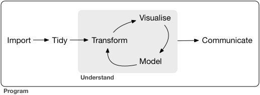
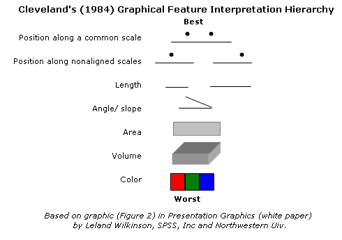

# Goals/contexts of data visualization

## Exploration

* find patterns (& problems) in data, explore hypotheses
* *nonparametric*/*robust* approaches: impose as few assumptions as possible
     * histograms for distributions
     * boxplots (median/IQR) instead of mean/std dev for grouped data
     * loess/GAM instead of linear/polynomial regression for continous data
* need for *speed*: quick and dirty
* canned routines for standard tasks, flexibility for non-standard tasks
* manipulate to visualize: summarize on the fly

 [HW on Twitter](https://twitter.com/hadleywickham/status/784780387180425217)

## diagnostic plots

* determine fitting problems, evaluate model assumptions
   * badness of fit, heteroscedasticity, non-Normality
   * identify outliers
* looking for **absence** of patterns in residuals
* e.g. scale-location plot, Q-Q plot; `plot.lm`
* plot methods: generic (e.g. residuals vs fitted) vs specific (e.g. residuals vs predictors)
* predictions (intuitive) vs residuals (amplifies/zooms in on discrepancies)
* evaluating neglected features (e.g. spatial, temporal autocorrelation):  
pictures easier than model
* code contrasts for visual simplicity  
(e.g. deviations from linearity: Q-Q plots)

## inferential

- coefficient plots: replacement for tables [@gelman_lets_2002]; `dotwhisker::dwplot`
- also: tests of inference @wickham_graphical_2010

## expository: data-viz

* should analyses match graphs?
    * "Let the data speak for themselves" vs "Tell a story"
* display data (e.g. boxplots, standard deviations) or inferences from data (confidence intervals)
* superimposing model fits (`geom_smooth`)

- tell an accurate story
- high information density
- Tufte, Cleveland

## Cleveland hierarchy

- [Cleveland hierarchy](http://sfew.websitetoolbox.com/post/clevelands-graphical-features-hierarchy-4598555): position, length, angle, area, volume, colour: also see @rauser_how_2016


## Aesthetics

- [Edward Tufte](http://en.wikipedia.org/wiki/Edward_tufte): chartjunk, data- and non-data-ink, small multiples, "information at the point of need"/direct labeling, ...
- graphics fascists: [dynamite plots](http://emdbolker.wikidot.com/blog:dynamite), [pie charts](http://wnnnww.qualia.hr/pie-chart-controversy/), [dual-axes plots](http://www.perceptualedge.com/articles/visual_business_intelligence/dual-scaled_axes.pdf) ...

## other ideas

-   Extending the pipeline: R vs [GLE](http://glx.sourceforge.net/) vs. [D3.js](https://d3js.org/) vs. [plot.ly](https://plot.ly/) vs. ...
-   Telling a story vs. letting the data speak
-   Showing the data vs. representing the statistical model accurately
-   Dynamic graphics

# R

## Base graphics

-   advantages: speed, simplicity, breadth
-   disadvantages: lack of structure, canvas metaphor, clunkiness, fragmentation
-   basic commands:
    -   `plot()`, `lines()` and `points()` and `text()` (add stuff to an existing plot)
    -   `legend()`, `axis()` (for decoration), `par()` (for all kinds of graphics parameters)
    -   other kinds of graphs: `matplot()` for multi-series plots, `boxplot()` for box plots, `hist()` for histograms, `contour()` and `image()`, `pairs`, ...
    -   `par(mfrow)`, `layout()` for multiple plots on a page
    -   useful packages: `car` (for `scatterplot()`, `scatterplotMatrix()`), `plotrix` (miscellaneous "plot tricks")

## Lattice graphics

- alternative, higher-level graphing interface
- `xyplot` (with `type=` one or more of `"p"`, `"l"`, `"r"`,`"smooth"`, `"a"` ...), `bwplot`
-   Disadvantages: tricky to customize
-   Advantages: abstraction (relative to base graphics), speed (relative to `ggplot`), banking (aspect ratio control), shingles, faceting, 3D plots

## [ggplot(2)](http://ggplot2.org)

-   **data**
-   **mappings**: between variables in the data frame and **aesthetics**, or graphical attributes
(x position, y position, size, colour ...)
-   first two show up as (e.g.) `ggplot(my_data,aes(x=age,y=rootgrowth,colour=phosphate))`
-   **geoms**:
   - simple: `geom_point`, `geom_line`


```r
(ggplot(my_data,aes(x=age,y=rootgrowth,colour=phosphate))+geom_point())
```

- more complex: `geom_boxplot`, `geom_smooth`

## more on ggplot2

- geoms are **added** to an existing data/mapping combination
- **facets**: `facet_wrap` (free-form wrapping of subplots), `facet_grid` (two-D grid of subplots)
- also: scales, coordinate transformations, statistical summaries, position adjustments
- advantages: pretty defaults (mostly), flexible, easy to overlay model predictions etc.
- disadvantages: slow, magical, tricky to customize
- general strategy for using ggplot or lattice:
    - primary response as y axis
    - most important predictor as x axis
(or substitute most important continuous or many-category predictor)
    - next (categorical) predictors as groupings (preferably colour/shape) within facets
    - next (categorical) predictors as facets

**Data presentation scales with data size**

* **small** show all points, possibly dodged/jittered, with some summary statistics: dotplot, beeswarm. Simple trends (linear/GLM)
* **medium** boxplots, loess, histograms, GAM (or linear regression)
* **large** modern nonparametrics: violin plots, hexbin plots, kernel densities: computational burden, and display overlapping problems, relevant
* combinations or overlays where appropriate (beanplot)

## Rules of thumb

* what goes where? Based on Cleveland hierarchy
     * (Continuous) response on the $y$-axis, most salient (continuous) predictor on the $x$-axis
     * Most salient comparisons within the same subplot (distinguished by color/shape), and nearby within the subplot when grouping bars/points
     * Facet rows > facet columns
* flip axes to display labels better (`coord_flip()`, `ggstance()` package)
* Use transparency to include important but potentially distracting detail
* Do category levels need to be *identified* or just *distinguished*?
* Order categorical variables meaningfully ("What's wrong with Alabama?"): `forcats::fct_reorder()`, `forcats::fct_infreq()`
* Choose *population variation* (standard deviations, boxplots) vs. *estimate variation* (standard errors, mean $\pm$ 2 SE, boxplot notches)
* Choose colors carefully (`RColorBrewer`/[ColorBrewer](colorbrewer2.org/), [IWantHue](http://tools.medialab.sciences-po.fr/iwanthue/)): respect dichromats and B&W printouts
* visual design (tweaking) vs. reproducibility (e.g. `ggrepel`, `directlabels` packages)

## challenges:

- multiple continuous predictors
- multivariate responses
- high-dimensional data generally
- factors with lots of (unordered) levels
- spatial data
- phylogenetic trees + tip data
- huge data sets (hexagonal binning, summaries)

ggplot2 [extensions](https://www.ggplot2-exts.org) can help

## Bits and pieces

- [Cookbook for R: Graphs](http://wiki.stdout.org/rcookbook/Graphs/), [R Graph Gallery](http://gallery.r-enthusiasts.com/), [R Graphics Cookbook](http://shop.oreilly.com/product/0636920023135.do) ($$)
- Exporting graphics: bitmap (PNG, JPEG) vs vector (SVG, PDF) representations
- Andrew Gelman's blog: Infovis vs. statistical graphics
-   [Paul Krugman on axes starting from zero](http://krugman.blogs.nytimes.com/2011/09/14/axes-of-evil/)
- Beyond 2D: `googleVis`, `Rggobi`, `rgl`, `Mondrian`, ...
